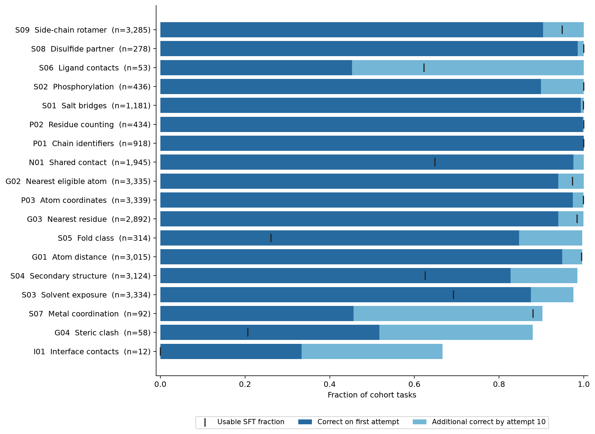
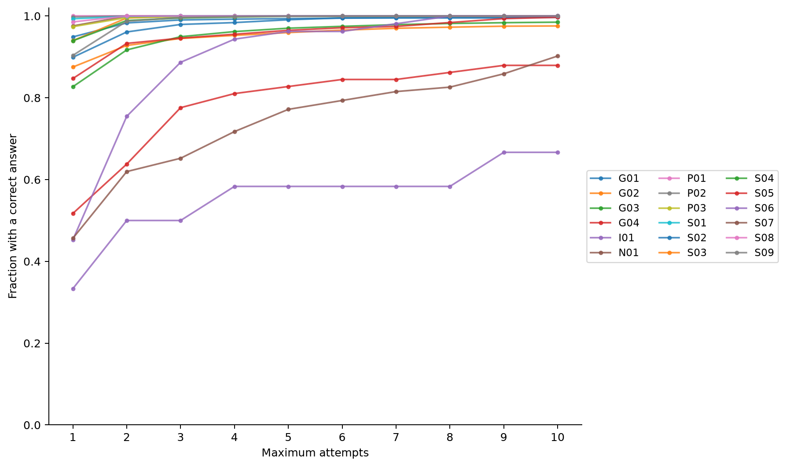
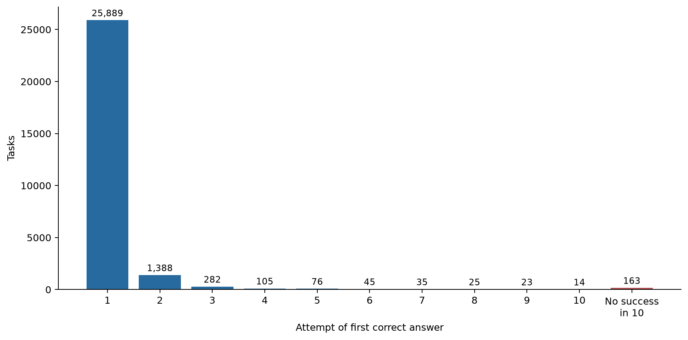
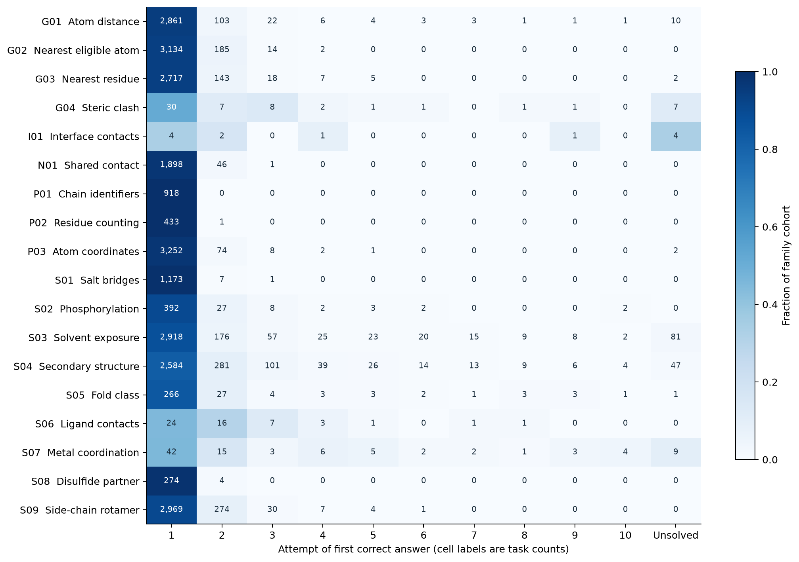

# PDBThink GLM-5.3 Teacher Traces

Published dataset: [open-athena/pdbthink-glm53-teacher-traces](https://huggingface.co/datasets/open-athena/pdbthink-glm53-teacher-traces/tree/91baf80abe4cd10e3258bbcc0addafd4d3d32b22).
Immutable revision: `91baf80abe4cd10e3258bbcc0addafd4d3d32b22`.
Release tag: `v1.0.0`. The [publication receipt](publication-receipt.json) records
matching hashes for all 154 uploaded files and anonymous loading checks for all
24,522 SFT rows, all 28,045 outcomes and a 100-row sample of the attempt stream.

**Complete.** 24,522 verified correct teacher traces fit Snowball's 32K
context, from 28,045 training tasks and 33,003 scored attempts.
GLM solved 25,889 on the first attempt and 27,882 within ten attempts.

First-attempt accuracy was **92.31%**, rising to **99.42%** within ten attempts.
Retries recovered 1,993 of the 2,156 initially failed tasks. By the third attempt,
27,559 tasks (98.27%) had succeeded; attempts four through ten added another 323.
The remaining 163 tasks had no native-verifier success in ten attempts.
Solvent exposure and secondary structure account for 128 of these failures.

Teacher success does not always yield a usable Snowball target: 3,360 correct
traces exceed its full context. The 24,522 retained SFT examples include 22,094
with at most 8,192 assistant tokens. Interface contacts produced eight correct
answers from 12 tasks, but none fit the student context; steric clashes produced
12 usable SFT examples from 58 tasks. These small and uneven family counts matter
when choosing the training mixture.

The source is [PDBThink Coordinate Tasks v1.2.0](https://huggingface.co/datasets/open-athena/pdbthink-coordinate-tasks/tree/fbd07fe7255f1f65d4d860c7561d5ae03110d1e9).
The cohort contains only training tasks with at least 8,192 tokens of output headroom
under the pinned Snowball tokenizer. All original validation/test tasks are excluded.

~~~python
from datasets import load_dataset
data = load_dataset("open-athena/pdbthink-glm53-teacher-traces", "sft", split="train",
                    revision="91baf80abe4cd10e3258bbcc0addafd4d3d32b22")
# Train on messages with the pinned Snowball chat template, enable_thinking=True.
# Mask system/user tokens; supervise the assistant reasoning and final answer.
~~~

- **sft:** first correct response per solved task with exact full-sequence length
  <=32,768. Contains messages, reasoning, answer and token counts.
  has_reasoning indicates whether the API emitted a separate reasoning field.
- **attempts:** every scored attempt, including incorrect and over-context correct
  traces, raw API response JSON, native verifier outcomes and exact student counts.
- **outcomes:** one row per cohort task, including first success, exhaustion and
  infrastructure-error counts. Use this population for denominators.

Teacher generation uses high reasoning effort, temperature 1.0 and top-p 0.95.
Each retry samples the unchanged prompt independently, without answers or feedback.
Stop at first correct answer or ten total scored attempts. API failures do not count
as wrong answers. The teacher uses its full remaining 262,144-token served context.
8K is a cohort reserve, not a teacher output cap; use completion_within_8k for the
stricter completion-length subset. No successful traces are truncated.

Reasoning and the final answer are joined with a blank line in one assistant message,
matching Snowball's plain assistant-text format. Their original text is also preserved
in separate columns. Exact student lengths use
open-athena/Snowball-67B-A2B-5.7T-Mixed-RLVR-Step38 at cfc1d845dae89b067cdc7250d0164abefa5a69cf. Prompt and assistant end tokens are included.

See [the full report](report.html), [summary](summary.json), and the plots below.
Counts are descriptive: tasks share structures. The curves show observed success
by attempt; we do not apply a fixed-sample pass@k estimator to this adaptive run.
A correct final answer does not prove correct reasoning.
Retries can find correct labels by chance in small categorical answer spaces;
compare first-attempt accuracy alongside cumulative success.
Training selection will need to account for family and success-selection imbalance.
T01 has no context-eligible examples; I01 has only 12.

| Family | Tasks | First try | Correct by ten | Unsolved after ten | SFT examples |
| --- | ---: | ---: | ---: | ---: | ---: |
| P01 — Chain identifiers | 918 | 100.0% | 100.0% | 0 | 918 |
| P02 — Residue counting | 434 | 99.8% | 100.0% | 0 | 434 |
| P03 — Atom coordinates | 3,339 | 97.4% | 99.9% | 2 | 3,336 |
| G01 — Atom distance | 3,015 | 94.9% | 99.7% | 10 | 2,999 |
| G02 — Nearest eligible atom | 3,335 | 94.0% | 100.0% | 0 | 3,247 |
| G03 — Nearest residue | 2,892 | 93.9% | 99.9% | 2 | 2,846 |
| G04 — Steric clash | 58 | 51.7% | 87.9% | 7 | 12 |
| S01 — Salt bridges | 1,181 | 99.3% | 100.0% | 0 | 1,180 |
| S02 — Phosphorylation | 436 | 89.9% | 100.0% | 0 | 436 |
| S03 — Solvent exposure | 3,334 | 87.5% | 97.6% | 81 | 2,307 |
| S04 — Secondary structure | 3,124 | 82.7% | 98.5% | 47 | 1,954 |
| S05 — Fold class | 314 | 84.7% | 99.7% | 1 | 82 |
| S06 — Ligand contacts | 53 | 45.3% | 100.0% | 0 | 33 |
| S07 — Metal coordination | 92 | 45.7% | 90.2% | 9 | 81 |
| S08 — Disulfide partner | 278 | 98.6% | 100.0% | 0 | 278 |
| S09 — Side-chain rotamer | 3,285 | 90.4% | 100.0% | 0 | 3,117 |
| I01 — Interface contacts | 12 | 33.3% | 66.7% | 4 | 0 |
| N01 — Shared contact | 1,945 | 97.6% | 100.0% | 0 | 1,262 |
| T01 — Two-state contacts | 0 | — | — | — | — |

Reproduction settings and native verifier hashes are in manifest.json. The deployed
teacher's immutable weight revision is unavailable; its tokenizer is pinned separately.
The source data's benchmark exclusions are preserved; they do not establish absence
from the teacher's pretraining. Coordinate gold is derived only from displayed coordinates.
Code is Apache-2.0; source coordinates originate in the public Protein Data Bank.

## Persistent-error spot checks

A targeted audit of 3 persistent distance failures found repeated coordinate-reading errors: GLM dropped a negative sign, then calculated a distance using the altered coordinate. Independent fixed-width PDB extraction and math.dist reproduced every audited gold answer. These deliberately selected examples illustrate a failure mechanism, rather than estimating its prevalence. See [the audit records](persistent-failure-spot-checks.json).

## Verifier boundary sensitivity

The frozen verifier rejected 11 numeric responses across 2 tasks at a floating-point tolerance boundary, although exact decimal comparison would accept them. 1 of these tasks exhausted ten attempts without a native-verifier success. The primary results, retry counts and SFT selection retain the original verifier's decisions; affected attempts and outcomes carry explicit flags. These cases should not be interpreted as evidence that GLM cannot meet the mathematical tolerance. A scorer correction requires a separate versioned task release. See [the diagnostic audit](tolerance-boundary-audit.json).

## Clash rule spot check

An independent all-pairs calculation on one exhausted steric-clash task reproduced the native gold from its 536 displayed atoms. GLM's final choice instead matches the largest overlap when cysteine SG–SG pairs are included. The benchmark excludes those pairs, but the prompt does not explicitly state that rule. This is a limitation of the prompt and of interpreting this failure as an arithmetic error. Scores remain those of the frozen verifier; the spot check does not estimate how often this occurs. See [the calculations](clash-failure-spot-check.json) and [frozen task input](clash-audit-task.json). Recompute with the published code:

~~~bash
python -m pdbthink.taskgen.teacher_clash_audit --task-json clash-audit-task.json --output recalculated-clash.json
~~~

## Reproduction and validation

[Generation, export and audit code](https://github.com/Open-Athena/pdbthink/tree/22b597370bacaa0c7165a9be3a0738259edc2231) are pinned at `22b597370bacaa0c7165a9be3a0738259edc2231`. Package versions and source hashes are in [code-provenance.json](code-provenance.json). The [release audit](release-audit.json) checks all submitted requests, attempt histories, SFT selection, raw response round trips, summary totals and full rendered token lengths.
